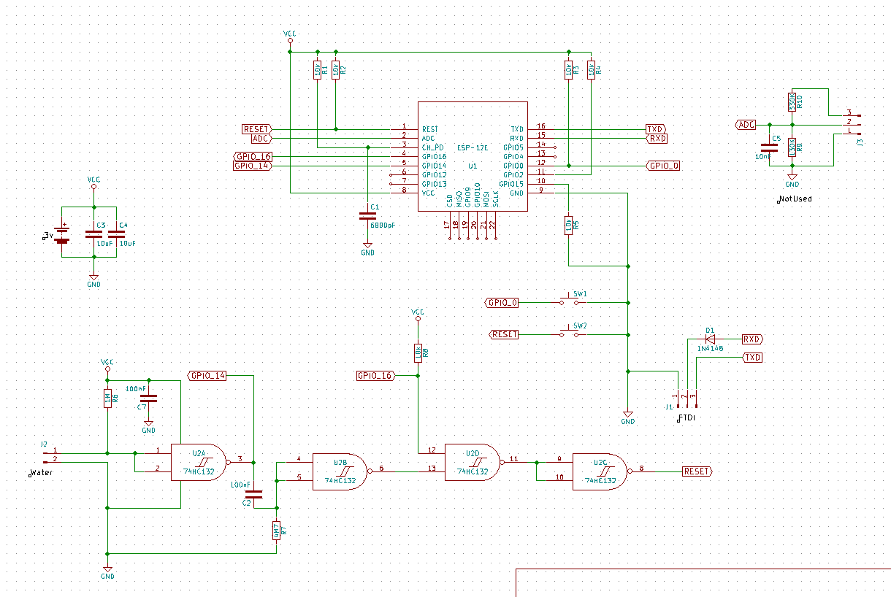

# DEEP_SLEEP SENSOR

An example of using the Maison framework using almost all features available.

It gets data from GPIO14 pin of an ESP-12E board and when its state changes, it sends a message to the MQTT broker. It is expected that hardware connexion will reset the chip when GPIO14 pin goes high such that the code will gain control before the end of the DeepSleep period. The pin state information is pushed as a message to the `maison/ctrl` topic. Possible values are "ON", "OFF" and "CHIRP". The "CHIRP" value is sent when the device has been awaken but the signal if OFF.

Here is an example of a hardware design for this piece of software:

Please note that the framework requires the presence of a file named `/config.json` located in the device SPIFFS flash file system. To do so, please 

1. Update the supplied data/config.json.sample file to your network configuration parameters
2. Rename it to data/config.json
3. Kill the PlatformIO Serial Monitor
4. Launch the "Upload File System Image" task of the PlatformIO IDE.
